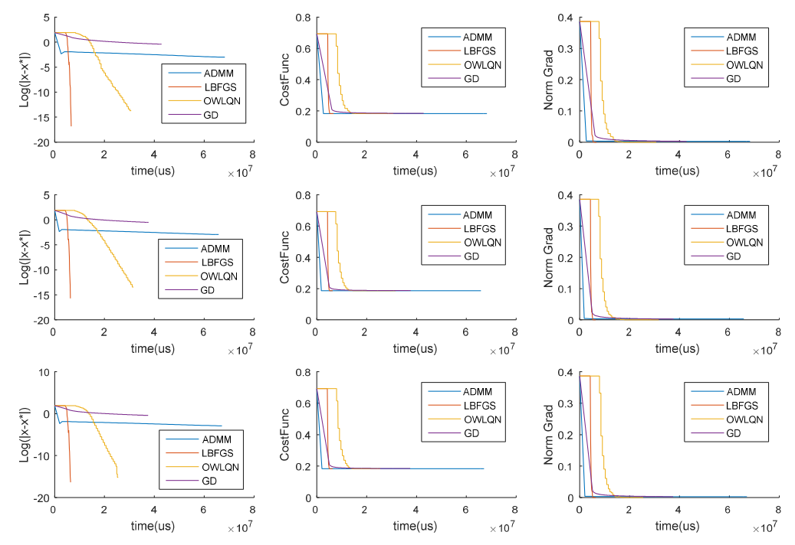
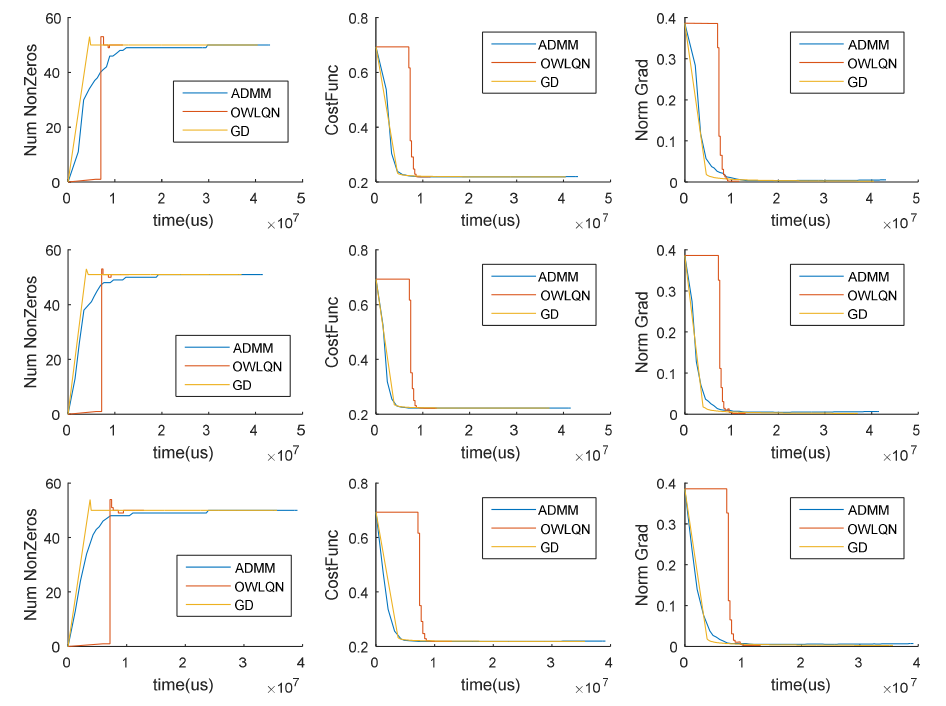

# Spark-Optimization-ADMM

This repository contains a benchmark for comparing Optimization Methods in Spark

We compare 4 Optimization methods:

- SGD
- OWLQN
- ADMM
- LBFGS

using 2 different problems

- Logistic Regression
- Logistic Regression with Lasso Regularization

## How to use it ?

run it with `sbt run`
I've been unable to upload the train files since they are several Gb in size. I'll try to come with a solution in the near future

-----

# Experimental Results

For the Logistic regression we observed that ADMM is much faster and achieves great results with only 2-3 iterations. 
However once it is near the solution, ADMM is unable to further optimize the parameters of the model

For the Logistic regression with Lasso regularization we observed that ADMM is almost as good as OWLQN but cannot outperform it

